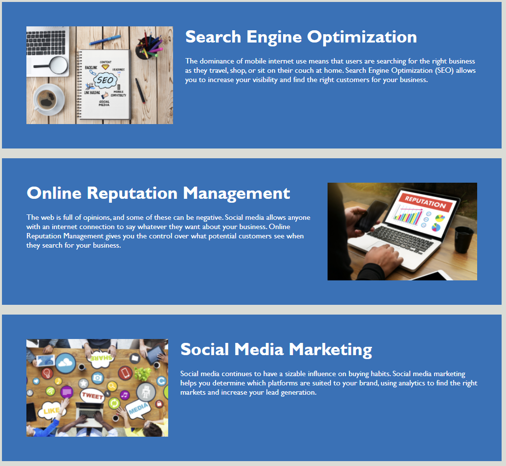

# Horiseon Landing Page

## The Repository

This repository contains the HTML and CSS source code for the Horiseon web page.

## Horiseon

Horiseon provides services that help your business build and manage its online presence. By finding the right platforms for your brand and increasing its search engine visibility across all devices, we can help your business generate leads, manage costs and build brand awareness.

The landing page for Horiseon was designed to provide a clean and effective user experience. By clicking on the links in the navbar, potential clients can quickly navigate the page to learn more about the services that we offer. On the right-hand side of the page, you'll find several of the numerous benefits our services provide. 

The web page was also designed with accesibility in mind. The source code makes extensive use of semantic HTML elements that clearly and concisely describe the form and function of the webpage, and the CSS code mirrors the structure of the HTML.

## Usage

The website provides three links within the navbar, as shown below:

Each element references the ID of the corresponding item in the "main" section of the HTML. By clicking on navbar link, the user can instantly navigate to one of the following elements;

And learn about the benefits we provide in the following section;

## Deployed Application

Please find the link to the deployed application below:

https://rrich-kray.github.io/Your-Landing-Spot-for-Success/

## Feedback

Leave comments/suggestions on the slack channel! 

## License

Copyright (c) Horiseon, Inc. All rights reserved.

